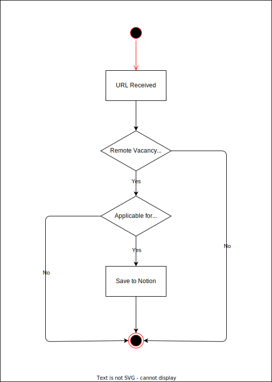

# IDN Remote Entry

This is the system that handles submission from [Submit Remote Job for Indonesian Talents](https://docs.google.com/forms/d/e/1FAIpQLSczxOnMSt-sK9X5e4tbccblbml0ik1r2fHKKCW-FST3hls5uQ/viewform?pli=1).

The reason why we are still using Google Form instead creating our own web app is because Google Form is much easier to setup, plus it comes with Google authentication out of the box. Since our goal is just to make it easy for community to submit remote vacancy, I think this kind of setup should be enough.

Here is the business logic for this system:

